<h1 align="center">Deep Bijwe</h1>
<h3 align="center">Cloud & DevOps Engineer — AWS · Kubernetes · Terraform · Jenkins · DevSecOps</h3>

  
  
  

  

---

## 👨‍💻 About Me

- 🔧 Cloud & DevOps Intern at **Hisan Labs Private Limited** (since Jan 2026)
- ☁️ Completed Cloud DevOps Engineering training at **Cloudblitz** (Jan–Jun 2026)
- 🎓 B.E. in Electronics and Telecommunication — Sant Gadge Baba Amravati University
- 📚 AWS Certified Cloud Practitioner (CLF-C02) — coursework complete, exam upcoming
- 🌱 Currently expanding into **Azure**, coming from an AWS-first background
- 🛠️ I build complete DevSecOps pipelines end to end — infra, security scanning, and deployment — and document each one as a step-by-step README
- 📍 Nagpur, Maharashtra, India

---

## 🧰 Tech Stack

| Category | Tools |
|---|---|
| **Cloud** |   |
| **Containers & Orchestration** |    |
| **Infrastructure as Code** |   |
| **CI/CD & DevSecOps** |     |
| **Languages & Frameworks** |     |
| **Database & Monitoring** |   |
| **Version Control** |   |

---

## 🏆 Flagship Project — Med-ERP Microservices: Full DevSecOps CI/CD on AWS EKS

**[github.com/deepbijwe/Med-ERP-Microservices-Project](https://github.com/deepbijwe/Med-ERP-Microservices-Project)**

A B2B medical ERP platform built as three independent Java/Spring Boot microservices, deployed through a fully automated, security-gated CI/CD pipeline to a production-style AWS EKS cluster.

**Architecture**
- **Backend:** `order-service`, `user-service`, `product-service` — Java + Spring Boot, each with its own MongoDB Atlas database (`order_db`, `product_db`, `user_db`)
- **Frontend:** React SPA, hosted on S3 static website hosting behind CloudFront (custom domain via Route 53)
- **Infra:** EKS cluster + S3, provisioned entirely through a dedicated Terraform pipeline
- **Ingress:** NGINX Ingress Controller (Helm-installed) routing to Kubernetes Services for each microservice
- **Registry:** Amazon ECR for container images

**Backend DevSecOps Pipeline (Jenkins)**

```mermaid
graph LR
    A[Git Checkout] --> B[Unit Tests]
    B --> C[Maven Build]
    C --> D[SonarQube Analysis]
    D --> E[Quality Gate]
    E --> F[OWASP Dependency Check]
    F --> G[Trivy FS Scan]
    G --> H[Docker Build]
    H --> I[Trivy Image Scan]
    I --> J[Push to Amazon ECR]
    J --> K[Configure kubeconfig]
    K --> L[Install NGINX Ingress]
    L --> M[Deploy to EKS]
```

| Stage | What it does |
|---|---|
| SonarQube Analysis + Quality Gate | Static code analysis for bugs, code smells and vulnerabilities before anything is built |
| OWASP Dependency Check | Scans Maven dependencies against the NVD database for known CVEs |
| Trivy FS Scan → Trivy Image Scan | Filesystem scan pre-build, then a full container image scan post-build |
| ECR Push → EKS Deploy | Versioned image push, followed by rolling deployment to the `med-erp` namespace |

**Infra Pipeline (separate Jenkins job, Terraform):**
`Checkout → Init/Validate → Plan → Manual Approval → Apply` — provisions the EKS cluster, node groups, and S3 bucket independently from the app pipeline.

**Frontend Pipeline:**
`Code Pull → npm install/build → S3 Sync → CloudFront Invalidation`

**Engineering highlights**
- Three independently deployable microservices, each with isolated data and env-based configuration
- Security scanning gated at four points in the pipeline (SAST, dependency, filesystem, image) rather than bolted on at the end
- Resolved real production-style issues along the way: a 503/CORS failure traced to missing Kubernetes Services behind the Ingress, and rolling-deploy capacity limits on a single-node group fixed by scaling the node group rather than starving pod availability
- Full three-tier stack (infra, backend, frontend, ingress) verified working end to end, including live registration/auth flow through the deployed frontend

---

## 🚀 Other Projects

#### ✈️ Flight Reservation Platform (Three-Tier, Terraform + EKS)
Terraform-provisioned infra (S3 + EKS + RDS), a Spring Boot backend deployed via Jenkins to EKS, and a React frontend synced to S3. Verified end to end with live data persistence in RDS.

#### 🔧 [Jenkins CI/CD Pipelines](https://github.com/deepbijwe/Jenkins-Projects)
A collection of Jenkins pipelines: Maven builds, SonarQube quality gates, Docker-based build agents, Trivy image scanning, and automated deployments to EKS — including a Node.js → Docker Hub → EKS pipeline triggered by GitHub webhooks.

#### ☁️ [AWS Projects](https://github.com/deepbijwe/AWS-projects)
Hands-on AWS practicals documented with architecture diagrams: EC2 provisioning with Terraform, multi-environment workspaces with S3 remote backend, modular EKS clusters, Kubernetes Ingress path-based routing, EBS CSI StatefulSets, and a 3-tier Dockerized app.

---

## 🏅 Certifications

- **AWS Cloud Quest: Cloud Practitioner** — [View Badge](https://www.credly.com/badges/780d14f3-80ef-477e-9cea-66addfaa0d5e/public_url)
- **AWS Cloud Quest: Generative AI** — [View Badge](https://www.credly.com/badges/39c95932-aaa1-4ad3-95a6-eb2ebb511a1b/public_url)

---

## 📊 GitHub Stats

  
  

> If a stats card above doesn't render, it's usually the `github-readme-stats` service being rate-limited or briefly down — refreshing the page or waiting a few minutes fixes it. If it stays broken, deploy your own instance of [github-readme-stats](https://github.com/anuraghazra/github-readme-stats#deploy-on-your-own) on Vercel and swap the URL in.

---

## 📫 Let's Connect

  
  

<i>Every project above ships with a step-by-step README — check the repos for the full build and troubleshooting log.</i>

